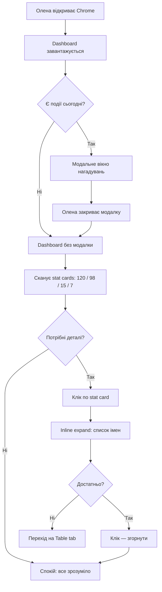
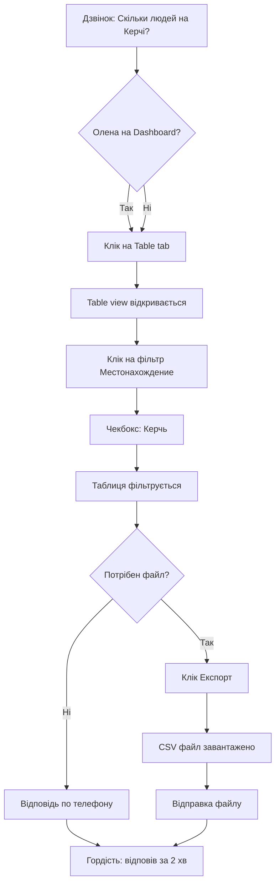
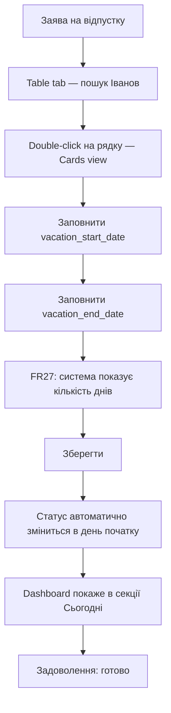
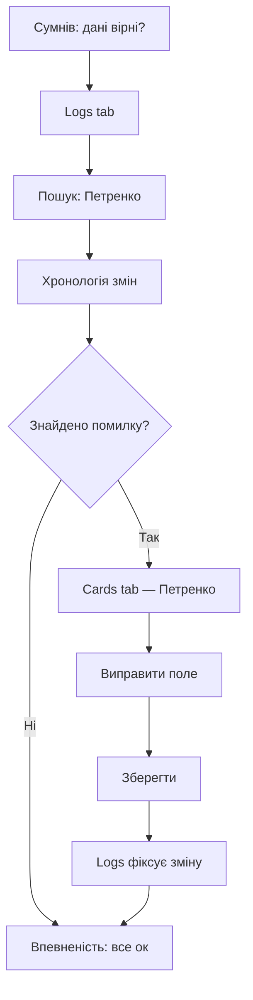

---
stepsCompleted:
  - step-01-init
  - step-02-discovery
  - step-03-core-experience
  - step-04-emotional-response
  - step-05-inspiration
  - step-06-design-system
  - step-07-defining-experience
  - step-08-visual-foundation
  - step-09-design-directions
  - step-10-user-journeys
  - step-11-component-strategy
  - step-12-ux-patterns
  - step-13-responsive-accessibility
  - step-14-complete
lastStep: 14
inputDocuments:
  - _bmad-output/planning-artifacts/prd.md
  - docs/ui-component-inventory-client.md
  - docs/state-management-patterns-client.md
  - docs/architecture-patterns.md
---

# UX Design Specification crm_manufactur

**Author:** Dim
**Date:** 2026-02-03

---

## Executive Summary

### Бачення проєкту

Локальна CRM-система для обліку співробітників виробничого підприємства (~120 працівників). Brownfield-проєкт — існуюча система (Vue.js 3 + Express.js, CSV-based storage) розширюється новими можливостями: Dashboard як домашня сторінка, розширені повідомлення про відпустки, генерація звітів за запитом.

**Диференціатор:** "Відкрив систему — і одразу все зрозуміло." Система проактивно показує повну картину стану персоналу замість ручного пошуку.

**Поточний UI:** Монолітний App.vue (46KB), 3 режими перегляду (Cards/Table/Logs), custom CSS (18KB), без UI фреймворка, без роутера. Динамічна генерація форм з fields_schema.csv.

### Цільовий користувач

**Олена** — адміністратор заводу, єдиний користувач системи.
- Веде облік 120 працівників
- Щоденно відповідає на запити керівництва
- Управляє відпустками
- Не IT-спеціаліст, впевнений користувач ПК
- Працює в Chrome на desktop (один комп'ютер)
- Потреба: швидкий доступ до інформації без пошуку

### Ключові UX-виклики

1. **Інформаційна ієрархія Dashboard** — 4 типи інформації (статистика, "сьогодні", "цього тижня", навігація) на одному екрані без перевантаження
2. **Навігація між 4 views** — Dashboard/Cards/Table/Logs замість поточних 3, навігація має залишатись інтуїтивною
3. **Звіти в існуючому UI** — розміщення кнопок звітів та відображення результатів
4. **Empty states** — поведінка Dashboard коли немає подій сьогодні/цього тижня

### Дизайн-можливості

1. **"5 секунд до картини"** — Dashboard як емоційний момент "aha!" через візуальну ієрархію та кольорове кодування стану
2. **Контекстна навігація** — клік по статистиці Dashboard одразу фільтрує Table (клік "15 у відпустці" → таблиця з фільтром "Відпустка")
3. **Один екран = одна відповідь** — швидкі звіти показують результат inline, без окремих сторінок

## Core User Experience

### Визначальний досвід

**Головна дія:** "Відкрити систему — і одразу все зрозуміло"

Олена відкриває CRM щоранку і за 5 секунд отримує повну картину стану персоналу. Dashboard — це не навігаційний хаб, а **самодостатній екран-відповідь**. Клік по статистиці розкриває деталі прямо на Dashboard (список імен), без переходу на інші екрани.

Друга за частотою дія: відповісти на запит керівництва за 1-2 хвилини через фільтрацію Table + експорт.

### Платформна стратегія

- **Платформа:** Desktop only, Google Chrome
- **Введення:** Mouse + keyboard
- **Мережа:** Завжди online (локальна мережа)
- **Offline:** Не потрібен
- **Архітектура:** SPA (Vue.js 3), новий Dashboard view додається до існуючих Cards/Table/Logs
- **Обмеження:** Монолітний App.vue, custom CSS, без UI фреймворка — дизайн має бути реалізовуваний у vanilla HTML + CSS

### Легкі взаємодії (Effortless Interactions)

| Взаємодія | Зусилля користувача |
|-----------|-------------------|
| Бачити повну картину стану | 0 кліків — Dashboard при відкритті |
| Дізнатись хто у відпустці | 0 кліків — статистика на Dashboard |
| Побачити список відпускників | 1 клік — розкрити деталі на Dashboard |
| Отримати нагадування | 0 кліків — модальне вікно автоматично |
| Згенерувати звіт | 1 клік — кнопка на Dashboard |
| Експорт для керівництва | 1 клік — кнопка на Table view |
| Зміна статусу відпустки | 0 кліків — автоматично |

### Критичні моменти успіху

1. **"Ранковий старт"** — Олена відкриває систему і за 5 секунд відчуває спокій, бо бачить всю картину. Якщо Dashboard перевантажений або незрозумілий — момент провалений.
2. **"Запит керівництва"** — Від дзвінка до відправки файлу — 2 хвилини. Якщо потрібно більше 3 кліків до відповіді — момент провалений.
3. **"Автоматичне повернення"** — Система сама змінила статус. Олена побачила на Dashboard підтвердження. Якщо треба перевіряти вручну — момент провалений.

### Принципи досвіду

1. **Dashboard — це відповідь, не вказівник.** Клік по елементу Dashboard розкриває деталі inline, не перенаправляє на інший екран.
2. **Нуль кліків до картини.** Все важливе видно одразу при відкритті системи.
3. **Один клік до дії.** Будь-яка активна дія (звіт, експорт, навігація) — максимум 1 клік.
4. **Система працює сама.** Автоматичні статуси, автоматичні нагадування, авто-рефреш. Олена лише контролює.

## Бажаний емоційний відгук

### Головна емоційна мета

**"Спокій контролю"** — Олена відчуває, що ситуація під контролем. Не тому що проблем немає, а тому що вона бачить повну картину і може діяти.

### Емоційна карта по сценаріях

| Сценарій | До системи | Під час | Після |
|----------|-----------|---------|-------|
| Ранковий старт | Тривога: "що я забула?" | Впевненість: бачу все | Спокій: можу планувати |
| Запит керівництва | Паніка: "де шукати?" | Фокус: фільтрую, експортую | Гордість: відповів за 2 хв |
| Оформлення відпустки | Рутина: "знову рахувати" | Легкість: система рахує сама | Задоволення: готово |
| Щось не так | Занепокоєння: "дані вірні?" | Розслідування: лог показує | Впевненість: виправив, все ок |

### Мікро-емоції

**Критичні для успіху:**
- **Впевненість** > Розгубленість — кожен елемент Dashboard зрозумілий з першого погляду
- **Довіра** > Скептицизм — числа точні, статуси актуальні, система не помиляється
- **Задоволення** > Фрустрація — дії завершуються одним кліком, без очікування

**Емоції яких уникаємо:**
- Перевантаженість (занадто багато інформації)
- Невпевненість (не розумію що означає число)
- Роздратування (зайві кліки, повільність)

### Дизайн-імплікації

| Емоція | UX рішення |
|--------|-----------|
| Спокій | Чиста візуальна ієрархія, багато "повітря", спокійна палітра |
| Впевненість | Числа великі та чіткі, кольорове кодування статусів |
| Довіра | Dashboard оновлюється автоматично, показує час оновлення |
| Гордість | Експорт — один клік, файл готовий миттєво |
| Контроль | Все важливе на одному екрані, без прокрутки до ключової інформації |

### Принципи емоційного дизайну

1. **Спокійна палітра, яскраві акценти.** Базовий UI спокійний (нейтральні тони). Кольори використовуються лише для кодування стану (зелений = працює, синій = відпустка, жовтий = увага).
2. **Числа замість слів.** "15" більше ніж "П'ятнадцять співробітників зараз у відпустці". Великі числа = миттєве розуміння.
3. **Відсутність новин = добра новина.** Порожній блок "Сьогодні" — це позитив ("Нічого термінового"), не порожнеча.
4. **Завжди видно "коли оновлено".** Мітка часу останнього оновлення на Dashboard — для довіри до даних.

## Аналіз UX-патернів та натхнення

### Аналіз продуктів-натхненників

**1. Basecamp — Dashboard як "щоранковий брифінг"**
- Один екран показує все що потребує уваги сьогодні
- Чітке розділення: "що нового" vs "що потребує дії"
- Мінімалістичний дизайн, багато білого простору
- **Релевантність для crm_manufactur:** Модель "відкрив — побачив картину" ідеально збігається з принципом "Dashboard = відповідь"

**2. Google Analytics — числові картки зі статистикою**
- Великі числа з кольоровим кодуванням (зріст = зелений, падіння = червоний)
- Hover/клік по числу розкриває деталі без переходу на іншу сторінку
- Компактні картки в сітці, що сканується зліва направо
- **Релевантність для crm_manufactur:** Патерн "число → клік → список імен" прямо відповідає Dashboard

**3. Notion — inline-розкриття та мінімалізм**
- Toggle-блоки: клік розкриває деталі на місці, без навігації
- Чиста типографіка, ієрархія через розмір шрифту
- Один стовпчик контенту — легко сканувати
- **Релевантність для crm_manufactur:** Inline expand для списку імен при кліку по статистиці

**4. Excel (звичний інструмент Олени)**
- Фільтрація стовпчиків через випадаючі списки з чекбоксами
- Подвійний клік для редагування
- Копіювання/експорт — звичні дії
- **Релевантність для crm_manufactur:** Table view вже побудовано за Excel-моделлю. Олена розуміє цю парадигму інтуїтивно

### Переносні UX-патерни

**Навігаційні патерни:**
- **Tab bar зверху** (Basecamp) — Dashboard | Cards | Table | Logs — 4 вкладки, активна підсвічена. Простіше ніж sidebar для 4 елементів
- **Breadcrumb-free** — при 4 views глибина навігації = 1, хлібні крихти не потрібні

**Патерни взаємодії:**
- **Stat card → inline expand** (Google Analytics) — клік по картці "15 у відпустці" розкриває список імен під карткою
- **Collapse/expand toggle** (Notion) — розкритий блок закривається повторним кліком
- **Double-click edit** (Excel) — вже реалізовано в Table view, зберігаємо
- **Multi-checkbox filter** (Excel) — вже реалізовано, зберігаємо

**Візуальні патерни:**
- **Числові картки в сітці 2×2** (Google Analytics) — для Dashboard статистики
- **Кольорове кодування без легенди** (Basecamp) — зелений/синій/жовтий/сірий інтуїтивно зрозумілі
- **Temporal sections** (Basecamp) — "Сьогодні" / "Цього тижня" як окремі блоки

### Анти-патерни яких уникаємо

- **Dashboard як навігаційний хаб** — дашборди що лише перенаправляють (проти принципу "Dashboard = відповідь")
- **Складні графіки для малих даних** — pie charts та bar charts для 120 записів — надлишково. Числа ефективніші
- **Sidebar навігація** — для 4 пунктів sidebar забирає простір без потреби
- **Notification badges** — один користувач, одна вкладка. Бейджі не потрібні — модальне вікно при відкритті достатньо
- **Зайва анімація** — робочий інструмент, не продукт. Анімації сповільнюють і дратують при щоденному використанні

### Стратегія дизайн-натхнення

**Адаптуємо:**
- Stat cards із Google Analytics → спрощена версія без графіків, тільки число + label + колір
- Inline expand із Notion → для розкриття списків імен на Dashboard
- Tab navigation із Basecamp → горизонтальні вкладки для 4 views
- Temporal blocks із Basecamp → секції "Сьогодні" / "Цього тижня"

**Зберігаємо (вже є):**
- Excel-like Table view з double-click edit та multi-checkbox filters
- Modal для нотифікацій про відпустки

**Уникаємо:**
- Графіків та діаграм (недоречні для масштабу)
- Sidebar навігації (забирає простір)
- Складного onboarding (один користувач, знає систему)
- Notification center / badge count (надлишково для single-user)

## Фундамент дизайн-системи

### Вибір дизайн-системи

**Custom CSS Design System (розширення існуючого)**

Проєкт використовує власний CSS (styles.css, 18KB) без UI-фреймворка. Додавання фреймворка (Vuetify, PrimeVue) до brownfield-проєкту з монолітним App.vue створить більше проблем ніж вирішить: конфлікти стилів, рефакторинг існуючих компонентів, зайва складність для одного розробника.

### Обґрунтування вибору

- **Brownfield-реальність:** Існуючий custom CSS працює. Перехід на фреймворк означає переписування всього UI — це не відповідає scope MVP
- **Один розробник:** Немає потреби в design tokens чи component library для team consistency — один розробник і є consistency
- **Один користувач:** Accessibility compliance (WCAG) не критичний для single-user internal tool
- **4 views:** Масштаб проєкту (Dashboard + 3 існуючих views) не вимагає повноцінної дизайн-системи
- **Excel-сумісність:** Custom CSS дозволяє точно відтворити звичні для Олени патерни Excel

### Підхід до реалізації

**Розширення існуючого styles.css:**
- Додати CSS-змінні (custom properties) для кольорової палітри та відступів
- Додати класи для Dashboard компонентів (stat-card, timeline-block, inline-expand)
- Зберегти існуючі класи для Cards/Table/Logs без змін
- Використовувати CSS Grid для layout Dashboard

**Компонентна стратегія:**
- Dashboard — новий HTML блок в App.vue з власними CSS класами
- Stat cards — повторюваний HTML pattern з CSS класами
- Inline expand — CSS transition для розкриття блоків
- Tab navigation — переробити існуючий view switcher на горизонтальні вкладки

### Стратегія кастомізації

**CSS Custom Properties (змінні):**

| Змінна | Значення | Призначення |
|--------|----------|-------------|
| `--color-status-active` | `#4CAF50` | Зелений — працює |
| `--color-status-vacation` | `#2196F3` | Синій — відпустка |
| `--color-status-warning` | `#FF9800` | Жовтий — увага |
| `--color-status-inactive` | `#9E9E9E` | Сірий — звільнений |
| `--color-bg-primary` | `#FAFAFA` | Фон |
| `--color-bg-card` | `#FFFFFF` | Картка |
| `--spacing-card` | `16px` | Відступ картки |
| `--radius-card` | `8px` | Радіус картки |

**Типографіка:**
- Числа на Dashboard: 32-48px, font-weight: 700
- Labels: 14px, color: #666
- Заголовки секцій: 18px, font-weight: 600

## Визначальний досвід (Defining Experience)

### Визначальна взаємодія

**"Відкрив — і все зрозуміло" (Glance to Know)**

Як Tinder = "Swipe to match", так crm_manufactur = **"Glance to know"**. Олена відкриває систему — і за 5 секунд має повну картину стану 120 працівників без жодного кліку.

### Ментальна модель користувача

**Олена думає категоріями Excel:**
- "Стовпчик = поле, рядок = людина"
- "Фільтр = знайти потрібних"
- "Подвійний клік = редагувати"
- "Виділити + скопіювати = звіт"

**Нова ментальна модель Dashboard:**
- "Число = скільки" (як формула SUM в Excel)
- "Клік по числу = розкрити список" (як клік по результату формули)
- "Колір = статус" (як conditional formatting)

Dashboard розширює звичну Excel-модель, не замінює її. Table view залишається "рідним Excel", Dashboard стає "Excel на стероїдах".

### Критерії успіху визначального досвіду

| Критерій | Метрика |
|----------|---------|
| Миттєве розуміння | < 5 секунд до повної картини |
| Нуль навчання | Олена розуміє Dashboard з першого разу |
| Самодостатність | 80% щоденних запитів вирішуються без переходу з Dashboard |
| Довіра | Числа збігаються з реальністю (авто-оновлення) |

### Аналіз патернів: встановлені vs нові

**Встановлені патерни (не потребують навчання):**
- Числові картки зі статистикою — знайомі з будь-якого dashboard
- Tab navigation — стандартний патерн
- Кольорове кодування — інтуїтивно зрозуміле
- Table з фільтрами — Excel-модель

**Адаптований патерн (мінімальне навчання):**
- Клік по stat card → inline expand зі списком імен. Не стандартний, але зрозумілий через affordance (cursor: pointer, hover ефект, стрілка ▼)

**Нових патернів немає.** Для single-user internal tool інновації в UX — це ризик, не перевага.

### Механіка визначального досвіду

**1. Ініціація:**
- Олена відкриває Chrome → Dashboard завантажується як домашня сторінка
- Система автоматично перевіряє відпустки, оновлює статуси
- Якщо є події сьогодні → модальне вікно з нагадуванням

**2. Взаємодія (Dashboard scan):**
- Зверху: 4 stat cards в сітці 2×2 (Всього | Працює | Відпустка | Інше)
- Під ними: блок "Сьогодні" (події дня)
- Далі: блок "Цього тижня" (найближчі події)
- Клік по stat card → під карткою розкривається список імен
- Повторний клік → список згортається

**3. Зворотний зв'язок:**
- Hover на stat card → cursor: pointer + subtle shadow
- Клік → плавна анімація розкриття (200ms ease)
- Числа оновлюються при кожному завантаженні
- Мітка "Оновлено: 08:45" внизу Dashboard

**4. Завершення:**
- Олена побачила картину → спокійна, переходить до інших задач
- Або: клікнула по stat card → побачила імена → закрила блок
- Або: перейшла на Table через tab для детальної роботи

## Візуальний фундамент дизайну

### Колірна система

**Філософія:** Спокійна палітра + яскраві акценти для статусів (принцип емоційного дизайну #1).

**Семантичні кольори статусів:**

| Роль | Колір | HEX | Використання |
|------|-------|-----|-------------|
| Працює | Зелений | `#4CAF50` | Stat card, badge, table row accent |
| Відпустка | Синій | `#2196F3` | Stat card, badge, timeline event |
| Увага (лікарняний) | Жовтий | `#FF9800` | Stat card, badge, warning |
| Звільнений | Сірий | `#9E9E9E` | Stat card, muted text |

**Нейтральна палітра:**

| Роль | HEX | Використання |
|------|-----|-------------|
| Фон сторінки | `#FAFAFA` | Body background |
| Фон картки | `#FFFFFF` | Cards, stat cards, modals |
| Бордер | `#E0E0E0` | Card borders, dividers |
| Текст основний | `#212121` | Body text, numbers |
| Текст вторинний | `#666666` | Labels, captions |
| Текст третинний | `#999999` | Placeholder, disabled |
| Hover фон | `#F5F5F5` | Table row hover, card hover |

**Accent:**

| Роль | HEX | Використання |
|------|-----|-------------|
| Primary action | `#1976D2` | Active tab, buttons, links |
| Primary hover | `#1565C0` | Button hover state |

### Типографіка

**Шрифт:** System font stack — `-apple-system, BlinkMacSystemFont, 'Segoe UI', Roboto, sans-serif`

Обґрунтування: без зовнішніх завантажень, нативний вигляд, кирилиця підтримується, вже використовується в існуючому CSS.

**Шкала типографіки:**

| Елемент | Розмір | Вага | Колір | Використання |
|---------|--------|------|-------|-------------|
| Число stat card | 36px | 700 | `#212121` | Головне число на Dashboard |
| Заголовок секції | 18px | 600 | `#212121` | "Сьогодні", "Цього тижня" |
| Label stat card | 14px | 400 | `#666666` | "Працює", "Відпустка" |
| Body text | 14px | 400 | `#212121` | Списки імен, таблиця |
| Caption | 12px | 400 | `#999999` | "Оновлено: 08:45", timestamps |
| Tab label | 14px | 500 | `#666` / `#1976D2` | Inactive / Active tab |

### Відступи та сітка

**Базова одиниця:** 8px

**Шкала відступів:**

| Token | Значення | Використання |
|-------|----------|-------------|
| `--space-xs` | 4px | Внутрішні gap між icon та text |
| `--space-sm` | 8px | Padding всередині елементів |
| `--space-md` | 16px | Gap між картками, padding карток |
| `--space-lg` | 24px | Gap між секціями Dashboard |
| `--space-xl` | 32px | Top/bottom margin секцій |

**Layout Dashboard:**
- CSS Grid: 2 колонки для stat cards (`grid-template-columns: 1fr 1fr`)
- Одна колонка для секцій "Сьогодні" / "Цього тижня"
- Max-width: 960px, центрування по горизонталі
- Padding: 24px зліва/справа

**Layout загальний:**
- Tab bar: fixed top, full width, height 48px
- Content area: під tab bar, scrollable
- Modal: centered, max-width 500px, backdrop rgba(0,0,0,0.3)

### Доступність

**Мінімальні вимоги (pragmatic для single-user):**
- Контраст тексту: основний текст `#212121` на `#FFFFFF` = 16.1:1 (WCAG AAA)
- Кольорове кодування статусів дублюється текстовими мітками (не лише колір)
- Фокусні стани для keyboard navigation (tab key)
- Hover states на всіх інтерактивних елементах

## Рішення щодо дизайн-напрямку

### Досліджені напрямки

Для brownfield-проєкту з існуючим UI (Cards/Table/Logs) варіативність дизайн-напрямків обмежена: новий Dashboard має візуально інтегруватись з існуючими views, а не виглядати як окремий продукт.

**Оцінені підходи:**

| Напрямок | Опис | Вердикт |
|----------|------|---------|
| Dense data dashboard | Максимум даних на екрані, compact cards | Відхилено — суперечить принципу "спокій", перевантажує |
| Card-based spacious | Великі картки з відступами, 1 колонка | Відхилено — забагато прокрутки для 4+ stat cards |
| **Grid stats + timeline** | Stat cards 2×2 зверху + часова стрічка знизу | **Обрано** — баланс інформативності та спокою |
| Full-width metrics bar | Горизонтальна панель метрик + content area | Відхилено — не масштабується при додаванні статусів |

### Обраний напрямок: Grid Stats + Timeline

**Структура екрану Dashboard (зверху вниз):**

```
┌─────────────────────────────────────────────┐
│  [Dashboard]  [Cards]  [Table]  [Logs]      │  ← Tab bar (48px)
├─────────────────────────────────────────────┤
│                                             │
│  ┌──────────────┐  ┌──────────────┐         │
│  │     120      │  │      98      │         │  ← Stat cards
│  │   Всього     │  │   Працює     │         │     row 1
│  │   ■ neutral  │  │   ■ green    │         │
│  └──────────────┘  └──────────────┘         │
│                                             │
│  ┌──────────────┐  ┌──────────────┐         │
│  │      15      │  │       7      │         │  ← Stat cards
│  │  Відпустка   │  │    Інше      │         │     row 2
│  │   ■ blue     │  │   ■ gray     │         │
│  └──────────────┘  └──────────────┘         │
│                                             │
│  ── Сьогодні ─────────────────────          │  ← Temporal section
│  ✈️ Петренко І.М. — початок відпустки       │
│  🏢 Сидоренко О.В. — повернення            │
│                                             │
│  ── Цього тижня ──────────────────          │  ← Temporal section
│  05.02 ✈️ Коваленко Д.А. — відпустка       │
│  07.02 🏢 Мельник Т.С. — повернення        │
│                                             │
│  Оновлено: 08:45                            │  ← Timestamp
└─────────────────────────────────────────────┘
```

### Обґрунтування дизайн-рішення

- **Grid 2×2** — оптимальне використання горизонтального простору, сканується F-патерном (зліва направо, зверху вниз)
- **Temporal sections** — хронологічна стрічка подій природна для "що відбувається сьогодні/цього тижня"
- **Inline expand** — клік по stat card "15 Відпустка" розкриває список імен під карткою, зсуваючи контент нижче
- **Neutral base** — `#FAFAFA` фон з `#FFFFFF` картками створює тонку глибину без візуального шуму
- **Мінімум декору** — без іконок в stat cards (тільки число + label + color accent), без borders навколо temporal sections

### Підхід до реалізації

**Dashboard view в App.vue:**
- Новий `v-if` блок для `currentView === 'dashboard'`
- CSS Grid для stat cards layout
- `v-for` для stat cards з dynamic data
- Click handler → toggle `expandedCard` ref
- Transition component для inline expand animation
- Computed properties для статистики з `employees` array

**Інтеграція з існуючим UI:**
- Tab bar замінює поточний view switcher (3 кнопки → 4 tabs)
- Dashboard стає default view при завантаженні (`currentView: 'dashboard'`)
- Існуючі views (Cards/Table/Logs) залишаються без змін

## Потоки користувацьких подорожей

### J1: Ранковий старт — "Що сьогодні на заводі?"

**Тригер:** Олена відкриває Chrome о 8:00



**Кліків до результату:** 0 (огляд) / 1 (деталі) / 2 (таблиця)

### J2: Запит керівництва — "Скільки людей на Керчі?"

**Тригер:** Телефонний дзвінок від директора



**Кліків до результату:** 3 (фільтр) / 4 (з експортом)

### J3: Оформлення відпустки — "Іванов йде у відпустку"

**Тригер:** Олена отримує заяву на відпустку



**Кліків до результату:** 4 (пошук, клік, дати, зберегти)
**Автоматично:** зміна статусу, відображення на Dashboard, повернення після відпустки

### J4: Перевірка даних — "Щось не так з Петренком"

**Тригер:** Сумнів у правильності даних



**Кліків до результату:** 2 (tab + пошук) / 5 (з виправленням)

### Патерни подорожей

**Навігаційні патерни:**
- Dashboard → Table: для детальної роботи з даними
- Table → Cards: для редагування конкретного працівника (double-click)
- Будь-який view → Logs: для аудиту та перевірки

**Патерни прийняття рішень:**
- Stat card → потрібні деталі? → inline expand або перехід на Table
- Table → потрібен файл? → експорт CSV
- Logs → знайдено помилку? → перехід на Cards для виправлення

**Патерни зворотного зв'язку:**
- Dashboard stat cards: числа = миттєвий стан
- Table фільтри: кількість рядків змінюється при фільтрації
- Cards збереження: візуальне підтвердження
- Logs: хронологічний запис кожної дії

### Принципи оптимізації потоків

1. **Мінімум переходів** — більшість задач вирішуються в 1-2 view без повернення назад
2. **Контекстне збереження** — при переході між tabs дані не втрачаються
3. **Автоматизація рутини** — статуси відпусток, нагадування, логування — без участі користувача
4. **Graceful degradation** — якщо Dashboard порожній (нема подій) — це позитивний сигнал, не помилка

## Компонентна стратегія

### Існуючі компоненти (зберігаємо без змін)

| Компонент | View | Статус |
|-----------|------|--------|
| Employee Card Form | Cards | Працює — динамічна генерація з fields_schema |
| Summary Table | Table | Працює — inline edit, multi-checkbox filters |
| Logs Table | Logs | Працює — пошук, хронологія |
| View Switcher | All | Переробити → Tab bar |
| Modal (notifications) | Cards | Працює — відпусткові нагадування |
| File Upload | Cards | Працює — PDF upload |
| Import Modal | Table | Працює — CSV import |

### Нові компоненти (Dashboard)

**1. Tab Bar (переробка існуючого View Switcher)**

| Властивість | Значення |
|-------------|----------|
| **Призначення** | Навігація між 4 views |
| **Анатомія** | 4 tab items: Dashboard · Cards · Table · Logs |
| **Стани** | Default (`#666`), Active (`#1976D2` + border-bottom 2px), Hover (`#333`) |
| **Поведінка** | Клік → переключає `currentView` ref |
| **CSS** | `display: flex; height: 48px; border-bottom: 1px solid #E0E0E0` |
| **Реалізація** | Замінити існуючі 3 кнопки на 4 горизонтальні tabs |

**2. Stat Card**

| Властивість | Значення |
|-------------|----------|
| **Призначення** | Показати одну метрику зі статусом |
| **Анатомія** | Number (36px, bold) + Label (14px) + Color accent (4px left border) |
| **Стани** | Default, Hover (shadow + cursor:pointer), Expanded (стрілка ▲) |
| **Варіанти** | По кольору: neutral/green/blue/yellow/gray |
| **Поведінка** | Клік → toggle inline expand під карткою |
| **CSS** | `background: #FFF; border-radius: 8px; padding: 16px; border-left: 4px solid var(--color)` |
| **Дані** | `{ label: string, count: number, color: string, employees: Employee[] }` |

**3. Inline Expand (Name List)**

| Властивість | Значення |
|-------------|----------|
| **Призначення** | Показати список імен при кліку по stat card |
| **Анатомія** | Список імен (ПІБ), з'являється під stat card |
| **Стани** | Hidden (height: 0), Visible (auto height, transition 200ms) |
| **Поведінка** | Повторний клік → згорнути. Одночасно розкрита лише 1 картка |
| **CSS** | `overflow: hidden; transition: max-height 200ms ease` |
| **Дані** | `employees.filter(e => e.status === cardStatus)` |

**4. Timeline Section**

| Властивість | Значення |
|-------------|----------|
| **Призначення** | Показати події "Сьогодні" / "Цього тижня" |
| **Анатомія** | Section header (18px) + список подій (emoji + ПІБ + опис) |
| **Стани** | Default, Empty ("Нічого термінового" — позитивний empty state) |
| **Поведінка** | Статичний — лише відображення, без інтерактивності |
| **CSS** | `margin-top: 24px; padding: 0` (без borders, без card background) |
| **Дані** | Computed з `employees` по `vacation_start_date`, `vacation_end_date` |

**5. Timestamp Footer**

| Властивість | Значення |
|-------------|----------|
| **Призначення** | Показати час останнього оновлення даних |
| **Анатомія** | "Оновлено: HH:MM" (12px, `#999`) |
| **Стани** | Завжди видимий |
| **CSS** | `text-align: right; color: #999; font-size: 12px; margin-top: 16px` |

### Стратегія реалізації компонентів

**Підхід:** Всі компоненти реалізуються як HTML-блоки в App.vue з CSS класами в styles.css. Окремі .vue файли не створюються (зберігаємо монолітну архітектуру).

**Повторне використання:**
- Stat Card → `v-for` з масивом конфігурації `[{label, filterFn, color}]`
- Timeline Section → спільний шаблон для "Сьогодні" та "Цього тижня", різні `computed`
- Tab Bar → `v-for` з масивом views `['dashboard', 'cards', 'table', 'logs']`

### Дорожня карта реалізації

**Фаза 1 — Критичний шлях (Dashboard MVP):**
1. Tab Bar — переробка view switcher (передумова для всього)
2. Stat Cards — головний елемент Dashboard
3. Timeline Sections — "Сьогодні" / "Цього тижня"
4. Timestamp Footer — довіра до даних

**Фаза 2 — Інтерактивність:**
5. Inline Expand — клік по stat card → список імен
6. Dashboard як default view при завантаженні

**Фаза 3 — Покращення (Growth):**
7. Кнопки звітів на Dashboard
8. Розширені нагадування (FR8-FR12)

## Патерни UX-консистентності

### Ієрархія кнопок

| Рівень | Стиль | Використання | Приклади |
|--------|-------|-------------|----------|
| Primary | `background: #1976D2; color: #FFF; border-radius: 4px; padding: 8px 16px` | Головна дія на екрані (1 на view) | "Зберегти", "Експорт", "Імпорт" |
| Secondary | `background: transparent; color: #1976D2; border: 1px solid #1976D2` | Допоміжні дії | "Скасувати", "Відкрити папку" |
| Danger | `background: #D32F2F; color: #FFF` | Деструктивні дії | "Видалити", "Видалити файл" |
| Icon-only | `background: transparent; cursor: pointer` | Компактні дії в таблиці | Фільтр toggle, sort |

**Правило:** Лише одна Primary кнопка на екран. Danger завжди з підтвердженням.

### Патерни зворотного зв'язку

| Ситуація | Механізм | Візуал | Тривалість |
|----------|----------|--------|------------|
| Успішне збереження | Inline message під формою | Зелений текст, "Збережено" | 3 секунди, зникає |
| Помилка збереження | Inline message під формою | Червоний текст, опис помилки | Постійно, поки не виправлено |
| Видалення | Модальне підтвердження | "Видалити [ПІБ]? Цю дію не можна скасувати" | До відповіді |
| Завантаження даних | Loading state | Dim existing content + spinner | До завершення |
| Експорт файлу | Browser download | Стандартний download браузера | Миттєво |
| Empty state (Dashboard) | Позитивне повідомлення | "Нічого термінового" сірим текстом | Постійно |

### Патерни форм

**Cards view (employee edit):**
- Динамічна генерація з `fields_schema.csv` — зберігаємо існуючий підхід
- Групування по `field_group` — секції розділені заголовками
- Validation: на стороні сервера (zod), фронтенд показує server errors
- Date fields: `<input type="date">` — нативний date picker Chrome
- Select fields: `<select>` з options з `field_options` column

**Table view (inline edit):**
- Double-click → input field з'являється в комірці
- Enter → зберегти, Escape → скасувати
- Tab → наступне editable поле (зберігаємо існуючий патерн)

### Патерни навігації

| Елемент | Поведінка |
|---------|----------|
| Tab bar | Клік → переключення view, active tab підсвічений (#1976D2 + border-bottom) |
| Table → Cards | Double-click на ID → відкривається картка працівника |
| Cards → Table | Tab "Table" → повертається з збереженими фільтрами |
| Будь-який → Dashboard | Tab "Dashboard" → завжди fresh data (reload) |

**Правило збереження стану:** Фільтри Table зберігаються при переході на інші tabs і повертаються. Dashboard завжди показує актуальні дані.

### Патерни модальних вікон

| Тип | Trigger | Вміст | Закриття |
|-----|---------|-------|----------|
| Нагадування відпусток | Автоматично при load (якщо є події) | Список подій сьогодні | Клік "Закрити" або Escape |
| Підтвердження видалення | Клік "Видалити" | "Видалити [ПІБ]?" + 2 кнопки | "Так" або "Скасувати" |
| Імпорт CSV | Клік "Імпорт" | File input + preview | Після імпорту або "Скасувати" |

**Backdrop:** `rgba(0,0,0,0.3)`, клік по backdrop = закрити (крім destructive confirmation).

### Патерни пошуку та фільтрації

**Table view:**
- Text search → фільтрує по всіх текстових полях
- Column filters → multi-checkbox dropdown per column (для select-полів)
- "(Пусто)" checkbox → показати рядки з порожнім значенням
- Фільтри комбінуються через AND
- Counter: "Показано: 45 з 120"

**Logs view:**
- Text search → фільтрує по employee_name, field_name, details
- Сортування: завжди descending по timestamp (newest first)

**Dashboard:**
- Без пошуку — stat cards та timeline не фільтруються (вони вже агреговані)
